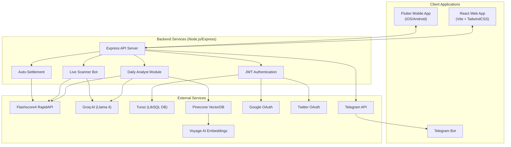
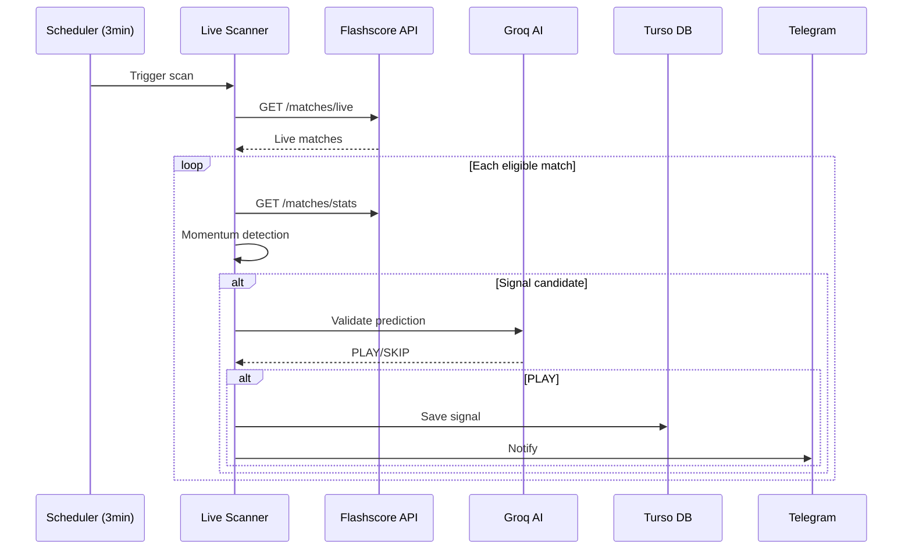
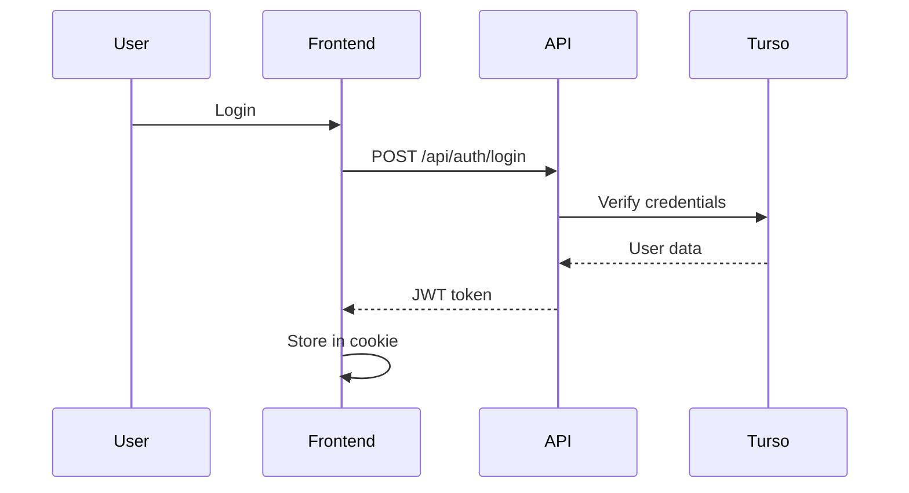

# GoalSniper-Pro — Handover Overview

> **Last Updated:** 2025-12-28  
> **Project Type:** SaaS Platform for AI-Powered Football Betting Signals  
> **Primary Language:** JavaScript (Node.js) + Dart (Flutter)

---

## Table of Contents
1. [Executive Summary](#executive-summary)
2. [Architecture Overview](#architecture-overview)
3. [Module Breakdown](#module-breakdown)
4. [3rd-Party Integrations](#3rd-party-integrations)
5. [Environment Variables](#environment-variables)
6. [Deployment Configuration](#deployment-configuration)
7. [Data Flow Diagrams](#data-flow-diagrams)
8. [Migration & Vendor Lock-in Risks](#migration--vendor-lock-in-risks)

---

## Executive Summary

**GoalSniper-Pro** is a full-stack SaaS platform providing AI-powered live betting signals for football matches. The system analyzes real-time match statistics from Flashscore, applies momentum detection algorithms, validates predictions using LLM AI (Groq/Llama), and delivers signals via web dashboard, mobile app, and Telegram.

### Key Features
- **Live Scanning Bot:** Real-time match monitoring with momentum-based signal generation
- **Daily Pre-Match Analysis:** Statistical analysis with AI validation for upcoming matches
- **Multi-Platform Delivery:** React web app, Flutter mobile app, Telegram bot
- **Admin Dashboard:** User management, signal approval, bet settlement
- **Training Data Collection:** Vector database for ML model improvement

---

## Architecture Overview



### Technology Stack

| Layer | Technology |
|-------|------------|
| **Backend** | Node.js 18+, Express 4.18, Passport.js |
| **Frontend (Web)** | React 19, Vite 7, TailwindCSS 4, Framer Motion |
| **Mobile** | Flutter 3.10+, Dart, Provider state management |
| **Database** | Turso (LibSQL) - SQLite-compatible edge database |
| **AI/ML** | Groq (Llama 4 Scout), Pinecone, Voyage AI |
| **Authentication** | JWT (jsonwebtoken), bcryptjs, Passport OAuth |
| **Hosting** | Backend: Render | Frontend: Cloudflare Pages |

---

## Module Breakdown

### Backend Structure (`/backend`)

```
backend/
├── server.js           # Main Express app, live scanner, API endpoints (3354 lines)
├── database.js         # Turso/LibSQL client, user CRUD, logging (382 lines)
├── auth.js             # JWT middleware (requireAuth, requireAdmin) (196 lines)
├── dailyAnalyst.js     # Pre-match analysis engine (1672 lines)
├── betTracker.js       # Local JSON-based bet history (legacy)
├── betTrackerRedis.js  # Redis-based bet tracking (unused)
├── approvedBets.js     # Admin-approved bets storage (Turso) (316 lines)
├── trainingPool.js     # Settled bets for ML training (Turso) (216 lines)
├── autoSettlement.js   # Automatic bet settlement scheduler (476 lines)
├── vectorDB.js         # Pinecone + Voyage AI integration (324 lines)
├── allowed_leagues.js  # League whitelist configuration (106 lines)
├── config/
│   └── passport.js     # Google & Twitter OAuth strategies
└── routes/
    ├── auth.js         # /api/auth/* (login, register, OAuth)
    ├── admin.js        # /api/admin/* (user mgmt, signals)
    ├── mobile.js       # /api/mobile/* (picks, stats, profile)
    └── picks.js        # /api/picks/* (curated picks)
```

### Core Module Descriptions

| Module | Purpose |
|--------|---------|
| `server.js` | Main Express app with live scanner bot, momentum detection, signal generation, Telegram notifications, all REST API endpoints |
| `database.js` | Turso/LibSQL client init, user CRUD, signal access control (free tier limits), system logging |
| `dailyAnalyst.js` | Pre-match analysis: fetches matches from Flashscore, H2H data, odds, team stats, AI validation via Groq |
| `approvedBets.js` | PENDING → WON/LOST bet lifecycle, mobile pick designation, per-market statistics |
| `autoSettlement.js` | Runs every 15 min, fetches final scores from Flashscore, evaluates predictions, updates training pool |
| `vectorDB.js` | Pinecone vector DB + Voyage AI embeddings for similar match retrieval |

### Frontend Structure (`/frontend/src`)

| Path | Purpose |
|------|---------|
| `App.jsx` | Router configuration, auth context |
| `pages/Landing.jsx` | Homepage with features |
| `pages/Auth/*` | Login, Register pages |
| `pages/Dashboard/*` | Main user dashboard |
| `pages/Admin/*` | Admin panel (user mgmt, signals) |
| `pages/Pricing.jsx` | Subscription tiers |
| `pages/Checkout.jsx` | Payment flow |
| `components/ui/*` | NeuButton, NeuCard (neumorphic design) |
| `components/SentioChat.jsx` | AI chat interface |

### Mobile App Structure (`/goalsniper_mobile_final/lib`)

| Path | Purpose |
|------|---------|
| `main.dart` | App entry, provider setup |
| `core/services/api_service.dart` | HTTP client for backend API |
| `core/providers/auth_provider.dart` | Authentication state management |
| `core/theme/*` | App colors and theme config |
| `screens/*` | All UI screens |

---

## 3rd-Party Integrations

### 1. Flashscore4 RapidAPI

| Aspect | Details |
|--------|---------|
| **Purpose** | Real-time match data, statistics, H2H, odds |
| **Files** | `dailyAnalyst.js`, `server.js`, `autoSettlement.js`, `betTracker.js` |
| **Endpoints** | `/matches/live`, `/matches/list-by-date`, `/matches/stats`, `/matches/h2h`, `/matches/odds` |
| **Rate Limit** | 2,000 requests/day |
| **Env Vars** | `RAPIDAPI_KEY`, `RAPIDAPI_HOST` |
| **Lock-in Risk** | 🟡 **MEDIUM** - Proprietary data format, no drop-in replacement |

### 2. Groq AI (Llama 4 Scout)

| Aspect | Details |
|--------|---------|
| **Purpose** | AI validation of betting predictions |
| **Files** | `server.js` (L694-800), `dailyAnalyst.js` (L627-693) |
| **Model** | `meta-llama/llama-4-scout-17b-16e-instruct` |
| **Endpoint** | `https://api.groq.com/openai/v1/chat/completions` |
| **Env Vars** | `GROQ_API_KEY` |
| **Lock-in Risk** | 🟢 **LOW** - OpenAI-compatible API, portable prompts |

### 3. Turso (LibSQL Database)

| Aspect | Details |
|--------|---------|
| **Purpose** | Primary database (users, bets, logs) |
| **Files** | `database.js`, `approvedBets.js`, `trainingPool.js` |
| **Client** | `@libsql/client` npm package |
| **Env Vars** | `TURSO_DATABASE_URL`, `TURSO_AUTH_TOKEN` |
| **Lock-in Risk** | 🟢 **LOW** - SQLite-compatible, standard SQL schema |

### 4. Pinecone Vector Database

| Aspect | Details |
|--------|---------|
| **Purpose** | Store match embeddings for similarity search |
| **Files** | `vectorDB.js` |
| **Env Vars** | `PINECONE_API_KEY`, `PINECONE_ENVIRONMENT`, `PINECONE_INDEX` |
| **Lock-in Risk** | 🟡 **MEDIUM** - Proprietary API, requires export for migration |

### 5. Voyage AI (Embeddings)

| Aspect | Details |
|--------|---------|
| **Purpose** | Generate text embeddings for vector search |
| **Files** | `vectorDB.js` (L62-88) |
| **Model** | `voyage-3.5-lite` (200M free tokens) |
| **Env Vars** | `VOYAGE_API_KEY` |
| **Lock-in Risk** | 🟢 **LOW** - Standard embedding format |

### 6. Google OAuth

| Aspect | Details |
|--------|---------|
| **Purpose** | Social login |
| **Files** | `config/passport.js` (L24-57), `routes/auth.js` (L215-234) |
| **Library** | `passport-google-oauth20` |
| **Callback** | `/auth/google/callback` |
| **Env Vars** | `GOOGLE_CLIENT_ID`, `GOOGLE_CLIENT_SECRET` |
| **Lock-in Risk** | 🟢 **LOW** - Standard OAuth2, optional feature |

### 7. Twitter OAuth

| Aspect | Details |
|--------|---------|
| **Purpose** | Social login |
| **Files** | `config/passport.js` (L62-96), `routes/auth.js` (L239-258) |
| **Library** | `passport-twitter` |
| **Callback** | `/auth/twitter/callback` |
| **Env Vars** | `TWITTER_CONSUMER_KEY`, `TWITTER_CONSUMER_SECRET` |
| **Lock-in Risk** | 🟢 **LOW** - Standard OAuth1, optional feature |

### 8. Telegram Bot API

| Aspect | Details |
|--------|---------|
| **Purpose** | Push signal notifications |
| **Files** | `server.js` (L634-690) |
| **Endpoint** | `https://api.telegram.org/bot{token}/sendMessage` |
| **Env Vars** | `TELEGRAM_BOT_TOKEN`, `TELEGRAM_CHAT_ID` |
| **Lock-in Risk** | 🟢 **LOW** - Simple HTTP API |

---

## Environment Variables

### Required (Core)

| Variable | Description |
|----------|-------------|
| `RAPIDAPI_KEY` | Flashscore4 API key |
| `RAPIDAPI_HOST` | `flashscore4.p.rapidapi.com` |
| `GROQ_API_KEY` | Groq AI authentication |
| `JWT_SECRET` | JWT signing secret |
| `ADMIN_PASSWORD` | Default admin password |

### Database

| Variable | Description |
|----------|-------------|
| `TURSO_DATABASE_URL` | Turso connection URL |
| `TURSO_AUTH_TOKEN` | Turso authentication |

### Vector Database (Optional)

| Variable | Description |
|----------|-------------|
| `PINECONE_API_KEY` | Pinecone authentication |
| `PINECONE_ENVIRONMENT` | Pinecone region |
| `PINECONE_INDEX` | Index name |
| `VOYAGE_API_KEY` | Voyage AI for embeddings |

### OAuth (Optional)

| Variable | Description |
|----------|-------------|
| `GOOGLE_CLIENT_ID` | Google OAuth app ID |
| `GOOGLE_CLIENT_SECRET` | Google OAuth secret |
| `TWITTER_CONSUMER_KEY` | Twitter OAuth key |
| `TWITTER_CONSUMER_SECRET` | Twitter OAuth secret |
| `SESSION_SECRET` | Express session secret |

### Notifications (Optional)

| Variable | Description |
|----------|-------------|
| `TELEGRAM_BOT_TOKEN` | Telegram bot token |
| `TELEGRAM_CHAT_ID` | Target chat/channel ID |

### Server Config

| Variable | Default |
|----------|---------|
| `PORT` | 3000 |
| `NODE_ENV` | development |
| `ALLOWED_ORIGINS` | localhost |
| `FRONTEND_URL` | localhost:5173 |

---

## Deployment Configuration

### Backend (Render)

- **Config:** `render.yaml`
- **Plan:** Free
- **Build:** `npm install`
- **Start:** `node backend/server.js`
- **URL:** `goalsniperai.onrender.com`

### Frontend (Cloudflare Pages)

- **Framework:** Vite
- **Build:** `npm run build`
- **Output:** `dist`
- **Auto-deploy from GitHub**

### Mobile App

- **API Base URL:** Hardcoded in `api_service.dart:8`
- **Platforms:** Android (Gradle), iOS (Xcode)

---

## Data Flow Diagrams

### Live Signal Generation



### Authentication Flow



---

## Migration & Vendor Lock-in Risks

| Service | Risk | Effort | Notes |
|---------|------|--------|-------|
| Flashscore4 | 🟡 Medium | High | No direct replacement |
| Groq AI | 🟢 Low | Low | OpenAI-compatible |
| Turso | 🟢 Low | Low | SQLite-compatible |
| Pinecone | 🟡 Medium | Medium | Proprietary API |
| Voyage AI | 🟢 Low | Low | Standard embeddings |
| OAuth | 🟢 Low | Low | Standard protocols |
| Telegram | 🟢 Low | Low | Simple HTTP |
| Render | 🟢 Low | Low | Standard Node.js |
| Cloudflare | 🟢 Low | Low | Static hosting |

### Critical Migration Notes

1. **Flashscore4** - Core dependency. Alternatives (API-Football, SportMonks) require schema rewrites
2. **Pinecone** - Export data before migration. Consider Supabase pgvector

---

## Quick Start

```bash
# Install
git clone https://github.com/p0wz/goalsniperai
cd goalsniper-pro && npm install
cd frontend && npm install && cd ..

# Configure
cp .env.example .env
# Edit .env with API keys

# Run
npm run dev              # Backend
npm run client           # Frontend (separate terminal)
```

---

## Resources

| Resource | URL |
|----------|-----|
| Repository | github.com/p0wz/goalsniperai |
| Backend API | goalsniperai.onrender.com |
| RapidAPI | rapidapi.com/dashboard |
| Turso | turso.tech/dashboard |
| Groq | console.groq.com |
